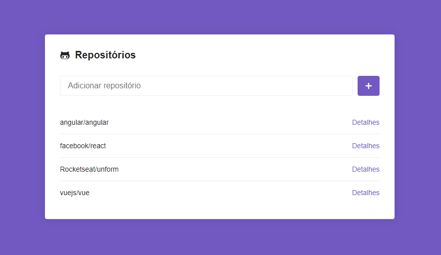
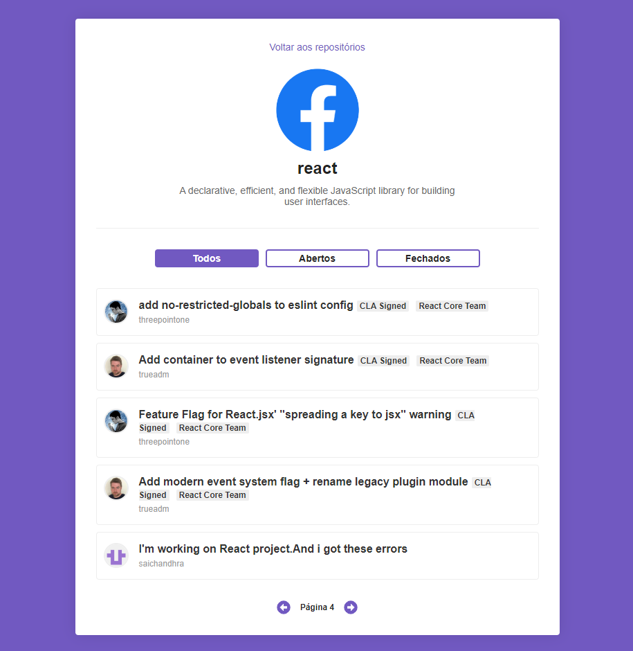

<h1 align="center">Desafio 05 GoStack - Rocketseat - Consumindo API Github</h1>

Projeto React consumindo a API do Github e exibindo repositórios cadastrados bem como suas respectivas issues.

<h2>Conceitos abordados</h2>
<ul>
<li>Router com react-router-dom</li>
<li>Estilização com styled-components</li>
<li>Consumo de API com axios</li>
<li>Componentização</li>
<li>Paginação de recursos</li>
<li>Filtro de recursos</li>
<li>Persistência de dados no local storage</li>
</ul>

<h2>Resultado da interface</h2>
Página de cadastro e listagem dos repositórios.

Página de detalhes do repositório e listagem de issues.

